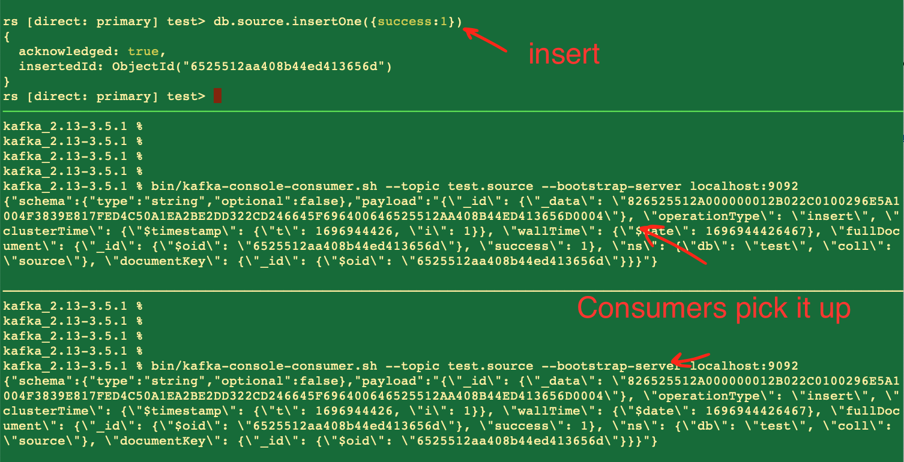

# workshop01

### Your mission:

Have 2 Kafka topic subscribers pick up an insert to the namespace test.source – this is what it will look like when you are done:


### Here is how:

#### Start a replica set or have one on Atlas:

```
# you can use any replica set, here is an example, don't forget rs.initiate():

mkdir dbpath
mongod --dbpath dbpath --bind_ip 0.0.0.0 --replSet rs
```

#### Start Kafka (standalone):

- If you don't have JRE: Download Java: https://www.java.com/en/download/manual.jsp
- Download Kafka: https://kafka.apache.org/downloads (binary .tgz file)
- Download newest MongoDB connector JAR file (pick the "all" version): https://repo1.maven.org/maven2/org/mongodb/kafka/mongo-kafka-connect/1.9.1/
  - put it into a directory, it's your "plugin.path"
- Extract kafka:


```
tar xfz kafka_2.13-3.5.1.tgz
cd kafka_2.13-3.5.1
```

And make sure Kafka can find the MongoDB Connector:
```
vi config/connect-standalone.properties
# add plugin.path= from above – for example:
plugin.path=/path/to/kafka_connector/workshop/plugins
```

Start zookeeper (Kafka requires it):
```
./bin/zookeeper-server-start.sh ./config/zookeeper.properties
```

Finally start Kafka:

```
./bin/kafka-server-start.sh ./config/server.properties
```

#### Create your first topic:

```
./bin/kafka-topics.sh --create --bootstrap-server localhost:9092 --topic test.source --replication-factor 1 --partitions 1
```

#### Subscribe to your first topic:

```
bin/kafka-console-consumer.sh --topic test.source --bootstrap-server localhost:9092
```
You should see a hanging prompt – nothing returned yet! You’re subscribed, so if there are any messages that come in, they’ll be returned! 

#### Start Kafka Source Connector with MongoDB Connector:

Create your MongoSourceConnector.properties , example: https://github.com/mongodb/mongo-kafka/blob/master/config/MongoSourceConnector.properties 
and start the connector:

```
./bin/connect-standalone.sh ./config/connect-standalone.properties ./MongoSourceConnector.properties
```

#### Does it work?

Connect to your database and run:

```
db.source.insertOne({success:1})
```
